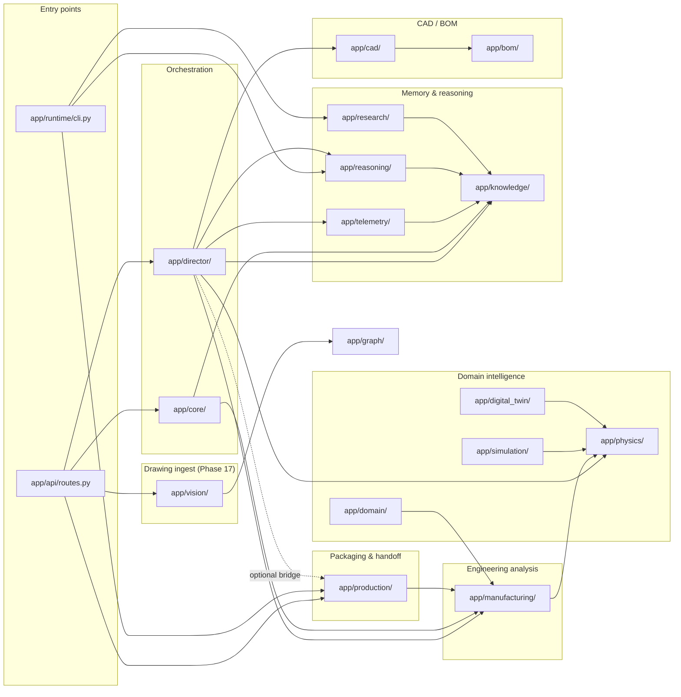

# Architecture map

This is the current dependency graph and layer-rule reference for the
platform. It is the artifact produced by the **Phase 15.5 architecture
audit** (commit preceding this doc) and is the source of truth for
"where does new code go?".

## Layer diagram



**Read this as:** arrows mean "depends on" / "imports from". The dotted
line marks the deliberate decoupling (director never imports production;
a small `build_production_package()` call would close the gap when
desired).

## Layer rules

| Layer | Owns | Forbidden |
|---|---|---|
| `app/director/` | pipeline orchestration, planning, evaluation, goal adaptation | duplicating engineering math from `manufacturing` or `physics` |
| `app/core/` | optimization loop, evolution, scoring, promotion | engineering derivations, IO outside the loop |
| `app/manufacturing/` | engineering analyzers, dataclasses, lookup tables, formulas | depending on `app.production`; writing files to disk |
| `app/production/` | packaging & handoff (dataclass shapes, G-code text, CSV, telemetry schema, orchestration) | engineering math; being imported by `manufacturing` |
| `app/physics/` | FEA / structural / thermal solvers | orchestration, IO outside simulation boundaries |
| `app/knowledge/` | append-only design memory (NDJSON), pattern queries | math derivations, mutation logic |
| `app/reasoning/` | mining & rules over knowledge records | mutating the knowledge store, physics derivations |
| `app/telemetry/` | sensor ingest, deviation detection, feedback triggers | manufacturing math, knowledge-store schema |
| `app/cad/`, `app/bom/` | OpenSCAD render, BOM generation | manufacturing analyzers, telemetry |
| `app/vision/` | PDF/image → MachineGraph extraction (Phase 17); single-direction dependency: may import from `app/graph/`, may NOT import from `app/core/`, `app/director/`, `app/manufacturing/`, `app/production/`, or `app/physics/`. The route in `app/api/routes.py` is the only place that bridges vision outputs into the orchestrator. | owning engineering math; touching the orchestrator or promotion logic; the champion pointer |
| `app/api/`, `app/runtime/cli.py` | HTTP and CLI surfaces | business logic; should delegate to `director` or `production` |

## Per-directory responsibility

| Package | One-line responsibility | Tests |
|---|---|---|
| `app/agents/` | Domain expert agents (designer, physics, manufacturing, …) that vote on design quality | `tests/test_agents.py` |
| `app/api/` | FastAPI routes, WebSocket gateway, request schemas | `tests/test_api_routes.py`, `tests/test_director_api.py` |
| `app/bom/` | Bill-of-materials generation from a machine graph | `tests/test_bom.py` (via integration) |
| `app/cad/` | OpenSCAD template + render + DXF projection | `tests/test_cad_generator.py` |
| `app/core/` | Multi-agent swarm, mutation, promotion, evaluation, improvement loop | `tests/test_evolution.py`, `tests/test_orchestrator.py`, `tests/test_optimization.py` |
| `app/digital_twin/` | Time-domain simulation, wear, fatigue, reliability | `tests/test_digital_twin.py` (via integration) |
| `app/director/` | Autonomous engineering pipeline (plan → CAD → BOM → physics → mfg → cost → eval → pack) and closed-loop `DynamicConstraint` adaptation | `tests/test_director.py`, `tests/test_director_api.py` |
| `app/domain/hemp/` | Hemp-process domain intelligence (fibre recovery, throughput, wear) | `tests/test_hemp.py` |
| `app/economics/` | Capital, operating, lifecycle, ROI, NPV, IRR | `tests/test_economics.py` |
| `app/evolution/` | NSGA-II multi-objective search | (covered by `test_evolution.py`) |
| `app/experiment/` | DOE / experiment lab | `tests/test_experiment_lab.py` |
| `app/factory/` | **Plant-scale layer**: FactoryGraph, mass/energy balance, bottleneck, layout, NSGA-II line optimization, input validation, predictive maintenance | `tests/test_factory.py` |
| `app/factory_director/` | (Phase 16.2) Combines per-machine manufacturing + production artifacts into plant-level orchestration | (added Phase 16.2) |
| `app/graph/` | MachineGraph + YAML compiler | `tests/test_graph.py` |
| `app/importers/` | External data import adapters | (covered by `test_graph.py`) |
| `app/knowledge/` | Append-only design memory, lesson query, pattern grouping | `tests/test_knowledge.py` |
| `app/main.py` | FastAPI app entry-point | (covered by API tests) |
| `app/manufacturing/` | **Engineering analysis layer**: cutlist, weldmaps, fabrication, assembly, machining, serviceability, costing | `tests/test_manufacturing.py` |
| `app/outputs/` | Built-in path constants for runtime outputs | (no tests, constants only) |
| `app/physics/` | Shaft, frame, rotor, bearing, fatigue, vibration analyzers | `tests/test_physics*.py` (via integration) |
| `app/production/` | **Packaging layer**: G-code, documents, QA plan, commissioning, telemetry schema, on-disk cutlist generator | `tests/test_production.py` |
| `app/realtime/` | Real-time streaming helpers | (covered by integration tests) |
| `app/reasoning/` | Correlation mining, range patterns, rule extraction, recommendations, adaptive mutation | `tests/test_reasoning.py` |
| `app/research/` | Autonomous research agent (entity/parameter/fact extraction, knowledge graph) | `tests/test_research.py` |
| `app/runtime/` | CLI, service registry, supervisor, backup, auth, audit, signing, deployment, distributed compute | `tests/test_runtime.py`, `tests/test_platform_ops.py` |
| `app/vision/` | **Drawing ingest pipeline (Phase 17)**: PDF/image → MachineGraph; constants, upload validation, orchestrator adapter. Pure-data layer; no imports from `app/manufacturing/`, `app/director/`, or `app/core/`. The route in `app/api/routes.py` is the only place that bridges vision outputs into the orchestrator. | `tests/test_vision.py`, `tests/test_supported_file_types.py`, `tests/test_size_enforcement.py`, `tests/test_confidence_floor.py`, `tests/test_drawing_ingest_e2e.py`, `tests/test_drawing_ingest_routes.py`, `tests/test_orchestrator_adapter.py`, `tests/test_revisions_ingestion_path.py`, `tests/test_drawing_ingest_and_build_routes.py` |
| `app/simulation/` | Steady-state process simulation | (covered by integration tests) |
| `app/telemetry/` | Sensor ingest, deviation detection, feedback triggers | `tests/test_hardware_feedback_loop.py` |
| `app/ai/` | Reserved for AI-specific helpers | (no current consumers) |

## The official factory → director bridge

There is exactly **one place** where the plant pipeline and the
machine pipeline meet:
`app/factory_director/planner.py:reliefs_to_dynamic_constraints()`.

```
   Plant pipeline                       Machine pipeline
   ──────────────                       ────────────────
   factory_director.run()  ──Relief──>   reliefs_to_dynamic_constraints()
                                            │
                                            ▼
                                       DynamicConstraint
                                            │
                                            ▼
                                       director.next_round()
                                            │
                                            ▼
                                       orchestrator.run()
                                            (with bound)
```

The `Relief` type is the factory director's output. The
`DynamicConstraint` type is the per-machine director's input.
The conversion function is the only place that knows the
shape of both. **If you add a new `Relief` type, you must
update `reliefs_to_dynamic_constraints()` in the same
change.** See `app/factory_director/director.py` for the
policy table that produces reliefs and
`app/factory_director/planner.py` for the conversion.

## The `manufacturing` ↔ `production` contract

This is the most-tested boundary in the platform and the one most
likely to drift. The two packages **must** respect this contract:

1. **Direction is one-way.** `app.production` imports from
   `app.manufacturing`. `app.manufacturing` never imports from
   `app.production`. `app.director` may import from both but
   *should not duplicate logic from either*.
2. **Math lives in `manufacturing`.** Any formula, lookup table,
   interpolation, or derivation belongs in a `*Analyzer` class. The
   production layer may *read* analyzer results and shape them, but
   must never recompute them.
3. **Dataclasses in `manufacturing` are the source of truth.** The
   `*Document` types in `app.production.models` are packaging shapes;
   if a field is also in the manufacturing result, prefer the
   manufacturing source via `getattr(...)` (see
   `app/production/documents.py` for the pattern).
4. **Policy choices that vary by code/standard belong in
   `manufacturing`.** A single hard-coded threshold (e.g. the NDT
   trigger in `app/production/qa.py:64-71`) is fine in production
   *until* the project needs to vary it — at which point it should
   migrate to a property on the manufacturing dataclass.

## Audit trail

This map is the artifact of the Phase 15.5 architecture audit, run on
2026-06-10. The audit confirmed:

- **No math duplication** between `manufacturing` and `production`.
- **No reverse-dependency violations**: zero hits for
  `from app.production` in `app/manufacturing/`; zero hits in
  `app/director/`.
- **No math hiding in production**: every calculation in production is
  either string formatting, a configuration ratio (alarm bands), or a
  rule over manufacturing data (NDT trigger).
- **One concrete cleanup**: `ProductionCutListGenerator` (a file-writing
  helper) was moved from `app/manufacturing/cutlists.py` to
  `app/production/documents.py`, where `build_cutlist_document` (its
  in-memory sibling) already lives. The class is now exported from
  `app.production` and the manufacturing layer contains only
  analyzers + dataclasses.

## Out of scope (deliberately)

These are real but *not* part of architectural cleanup:

- **Director → production bridge.** The director does not call
  `build_production_package()` at the end of `run()`. The decoupling is
  intentional: production artifacts are an "outward-facing opt-in"
  (see `app/production/models.py` docstring). Wiring it in is a Phase
  16 (or later) feature decision, not a boundary fix.
- **NDT trigger migration.** A single hard-coded threshold in
  `app/production/qa.py` is fine where it is. If/when the project needs
  to vary it by code (ASME vs. AWS), it should migrate to
  `WeldJoint.requires_ndt` in `app/manufacturing/weldmaps.py`.
- **Test boundary.** Tests already align with the code boundary:
  `tests/test_manufacturing.py` exercises analyzers;
  `tests/test_production.py` exercises packaging. No restructuring
  required.

## Factory layer rule (added Phase 16.1)

`app/factory/` is a **plant-scale** layer that sits above
`app/manufacturing/` (which is per-machine). The dependency rules are
the same shape as the manufacturing ↔ production contract:

1. **Direction is one-way downward.** `app/factory/` analyzers may
   import from `app/manufacturing/` and `app/physics/`. `app/manufacturing/`
   and `app/physics/` never import from `app/factory/`. The factory
   layer depends on per-machine primitives; the per-machine layers
   have no knowledge of the line they happen to be in.
2. **Math lives in `manufacturing` and `physics`.** A factory formula
   that recomputes a per-machine result (mass balance of a single
   unit, cycle time, weld mass) belongs in the manufacturing analyzer
   it duplicates. The factory layer may *sum*, *compose*, or
   *iterate*, but it does not *re-derive*.
3. **The factory director is the only place allowed to combine
   manufacturing + production artifacts.** That is the whole point of
   a factory director: it takes per-machine manufacturing analyses
   and per-machine production packages and decides what to do with
   the line as a whole. Subordinate factory analyzers (mass balance,
   energy balance, bottleneck, layout, optimization) may not import
   from `app/production/`; only the director may.
4. **`app/production/` is the packaging layer for factory outputs the
   same way it is for machine outputs.** A factory KPI dashboard, a
   plant-wide commissioning plan, and a multi-machine production
   package are all packaging concerns and live in
   `app/production/`. The factory director calls into production the
   same way `app/director/` does.

This rule is enforced by the Phase 16.1 audit: `app/factory/*.py` was
checked for any `from app.production` import (zero hits) and any
math duplication with `app/manufacturing/` (zero hits). New factory
code that needs to cross the boundary must do so through
`app/factory_director/` (added in Phase 16.2), never by reaching
across from a leaf analyzer.

### Why predictive maintenance lives in `app/factory/` (not `app/manufacturing/`)

Phase 16.3 added `app/factory/predictive_maintenance.py` with
`BearingHealthMonitor`, `ShaftFatigueAccumulator`, and
`MaintenanceScheduler`. The natural question is: why factory, not
manufacturing? The answer is **scope**:

- `app/manufacturing/` analyzers (`cutlists.py`, `weldmaps.py`,
  `machining.py`, etc.) are *per-machine* and per-build. A
  manufacturing analyzer answers "given this part, what is the cut
  schedule?". Its lifecycle is one build.
- `app/factory/predictive_maintenance.py` is *cross-machine on a
  line* and *over time*. A bearing belongs to a unit that appears
  in a `FactoryProcessGraph`; the scheduler rolls per-component
  health records into a single plant-wide maintenance plan. Its
  lifecycle is the operating life of the line.

The PM module imports from `app.physics.bearings` and
`app.physics.fatigue` (allowed by rule 1) and *consumes* their
results without re-deriving L10h or Miner's-rule math (compliant with
rule 2). The output is a `MaintenanceSchedule` — a planning artifact
the factory director will consume, not a manufacturing analysis.
If the line ever needs the *underlying* bearing analysis as a
manufacturing deliverable (e.g. a bearing datasheet for a build
record), the analyzer in `app.physics.bearings` is the source of
truth; the PM module is the plant-level rollup.
